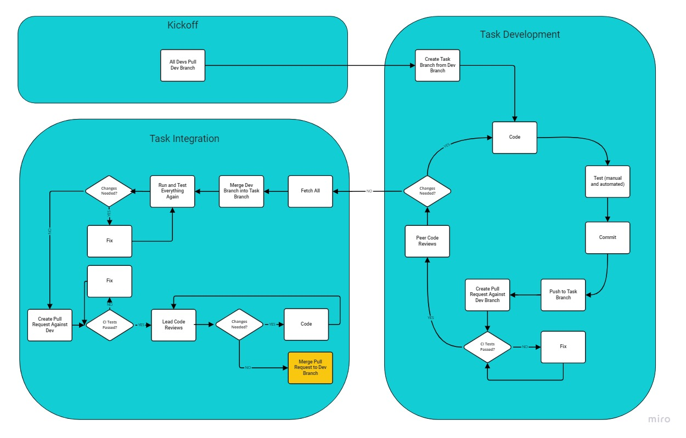

# Git Workflow

# Definition of Done

Wanna contribute and merge your work into main?  Check you have met the DoD below.

1. Code fulfils the user story and scenarios set out in the github task and UI prototype.
2. The feature has been thoroughly manually tested. Ask other devs to give some fresh eyes on this as you go.
3. Run all tests from terminal, fix any broken ones.
> `npm test`
4. Be pragmatic about adding new tests. Think; how critical is this module or function? If this function broke due to changes, how would it affect the user experience?
5. Run eslint for code analysis. Fix any issues.
> `npm run lint`
6. Create a PR in Github.
7. Get two peer reviews from other devs.
8. Get one peer review from one of the teachers.
9. After all the peer review comments are addressed, merge your branch back to main.

